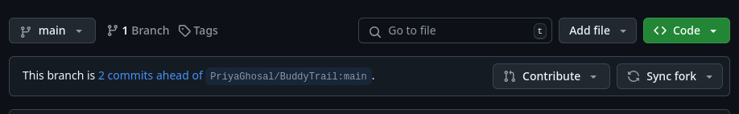

<h1 align="center"> Hacktoberfest-2024 </h1>

This repo is a beginner friendly repo where you can make your first `OPEN SOURCE` contribution.

I have seen many people struggle to contribute because of wide variety of tech stack used by the developers so I thought of doing this little experiment , Here in this repository you don't have any specific tech stack, you can use any tech stack that you are comfortable with, you can push your portfolio, a cool component , a landing page that you made in a hackathon , it can be anything, if you are not a coder just push a cool picture of your pets, nature , laptop setup what ever you can . The ultimate goal of this repo is to get people started their open source contributions and get their four PRs merged before hacktoberfest ends. 

# Note

This repository is particularly for the beginners so give them a chance to get started , if you know someone who is beginner and wanted to get started you can share this to them.

## Contribution Guide
## Make sure that you have pulled the latest changes before making any contribution 
1. Fork this repo, to do so click on this fork icon 
2. Then click on create fork.
3. Make necessary code changes that you wanted.
4. Push the code to main branch
5. Open the repo and you can see something like contribute 

6. Click on contribute and click on open pull request.
7. Give the title for the changes you made or the code you added , and give the description for the changes.
8. Wait for someone to merge the pull request.
